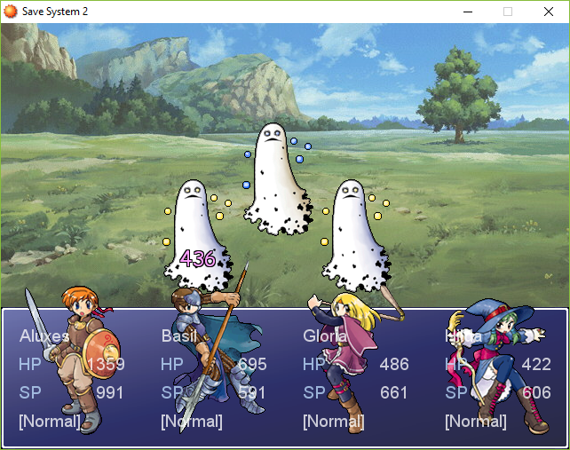
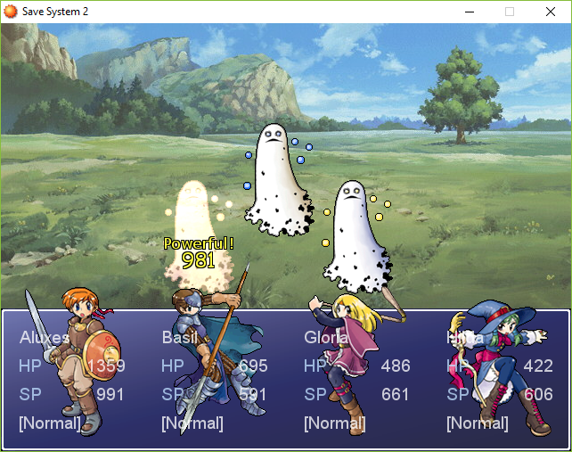
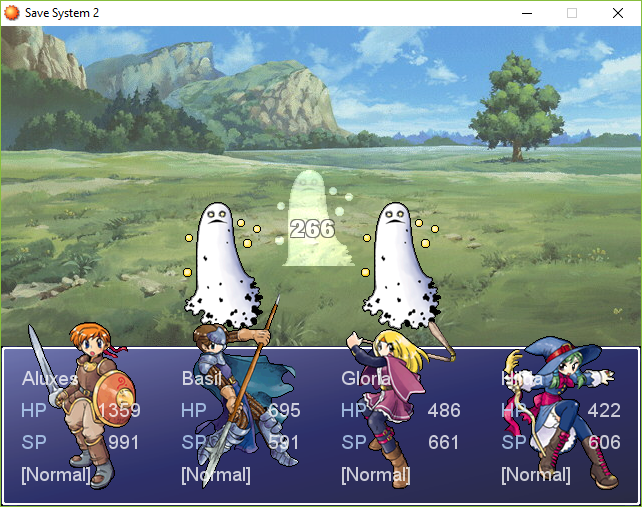

# RPG::Sprite (Rewrite & Extension)

## Description

**RPG::Sprite** is a class used in RPG Maker XP for battlers and characters, to display effects such as damage, animations, and various other things. It is not accessible from the editor but can be reached using the Help file (F1).

---

The first script (_RPG::Sprite (Rewrite)_) is a rewrite of the core class, inspired from **Sprite_Base** from **RPG Maker VX Ace**, along with a few additions. All effects from this script are the ones already in RPG Maker XP.

Some constants have been added at the beginning of the script for **non-scripters** to change a few things:
* Text for **missed attacks** and **critical hits**.
* Text **font** and **color** for all types of damage displayed on screen
  * Normal damage
  * Recovery damage
  * Critical hits
  * Missed attacks

It is also easier now for **scripters** to use aliases or edit methods in subclasses without altering the main class.

---

The **second script** (_RPG::Sprite (Ace Style)_) is a little extension. It brings in a few **effects from RPG Maker VX Ace** into XP.
- Different colors for the **whiten** and **collapse** effects
- A special **boss_collapse** effect (to set an enemy as a boss, follow the instructions in the script), together with sound.

---

## Screenshots

Normal damage font and color change

Critical damage text, font and color change

Boss collapse effect from VX Ace

